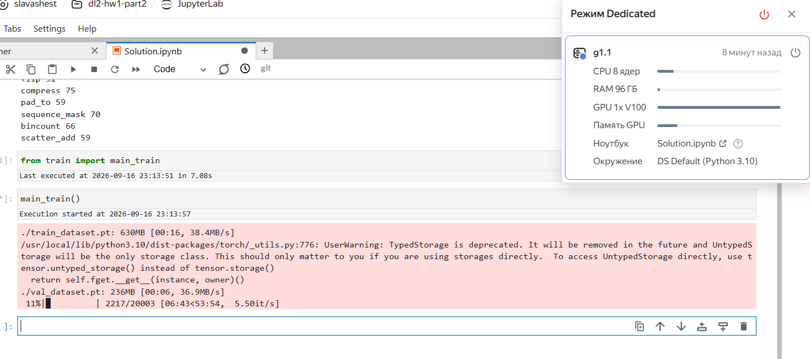
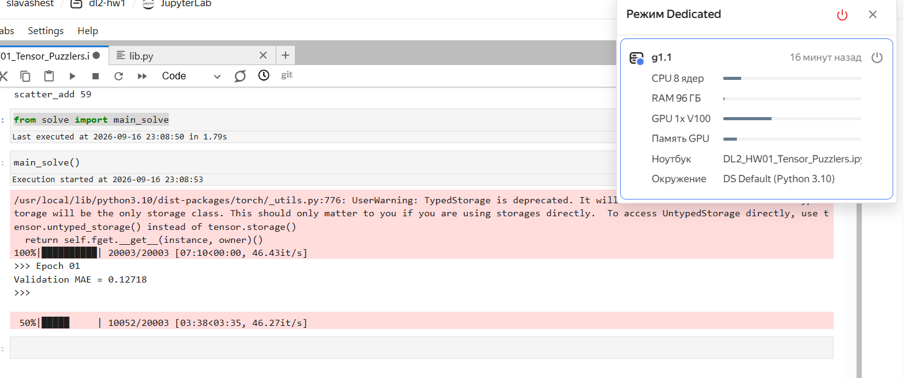

# Оптимизация формулы

Исходное:
```py
x_emb = x_emb.unsqueeze(1) + self.dense_expand(x_emb.unsqueeze(-1)).permute(0, 3, 1, 2)
x_out = (mask.unsqueeze(-1) * x_emb).sum(dim=2)
```

Вычисляем:
$$x\_unseq_{-1}[i, j, k, l] = x\_emb[i, j, k]$$
$$expand[i, j, k, l] = w[l] * x\_unseq_{-1}[i, j, k, l] + b[l] = w[l] * x\_emb[i, j, k] + b[l]$$
$$permute[i, j, k, l] = expand[i, k, l, j] = w[j] * x\_emb[i, k, l] + b[j]$$
$$(mask * x\_emb)[i, j, k, l] = mask[i, j, k] * (x\_emb[i, k, l] + permute[i, j, k, l])$$
$$x\_out[i, j, k] = \sum_{l} (mask * x\_emb)[i, j, l, k] = \sum_{l} \left( mask[i, j, l] * (x\_emb[i, l, k] + permute[i, j, l, k]) \right) = \sum_{l} \left( mask[i, j, l] * (x\_emb[i, l, k] + w[j] * x\_emb[i, l, k] + b[j]) \right) = \sum_{l} \left( mask[i, j, l] * ((1 + w[j]) * x\_emb[i, l, k] + b[j]) \right) = (1 + w[j]) \sum_{l} mask[i, j, l] * x\_emb[i, l, k] + b[j] \sum_{l} mask[i, j, l] = (1 + w[j]) \sum_{l} mask[i, j, l] * x\_emb[i, l, k] + b[j]$$

Итого:
$$x\_out[i, j, k] = (1 + w[j]) \sum_{l} mask[i, j, l] * x\_emb[i, l, k] + b[j]$$

Заметим что для фиксированного $i$ тут сумма как в матричном умножении, поэтому нас спасет `torch.bmm`:

```py
w = (1 + self.dense_expand.weight.squeeze(-1)).unsqueeze(0).unsqueeze(-1)
x_out = w * torch.bmm(mask, x_emb) + self.dense_expand.bias.unsqueeze(0).unsqueeze(-1)
```

Это теоретические выклдаки, на практике проверить до мягкого дедлайна не успел. Но смог запустить обучение, по нему уже заметно что стало лучше:

Исходное:


С оптимизациями:


Правда на обучении лучше только в раз 10, получается зря старался
